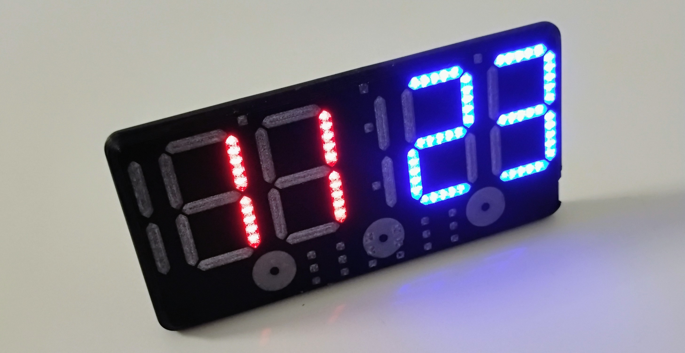
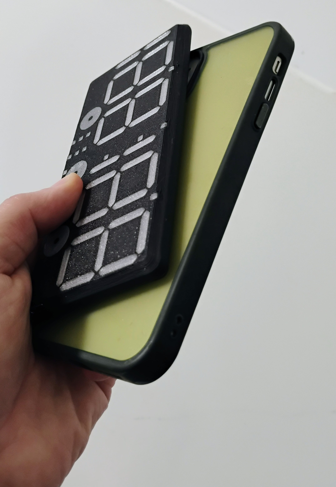
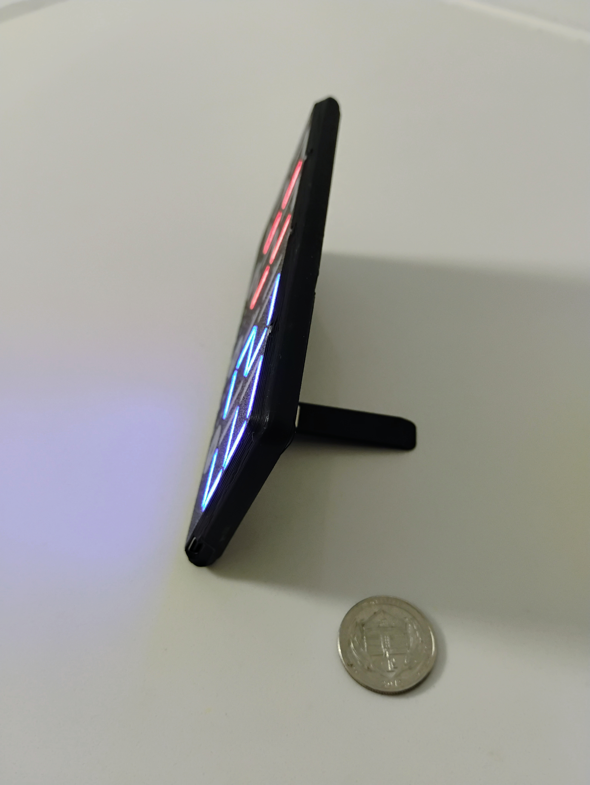

## Open Scoreboard

This project is a pocket scoreboard with Android/iOS/WatchOS apps.

The goal is a mass market product.  It beats out the existing devices on the market in features and price.

It really is small enough to fit in a pocket, and the battery lasts for up to 2 days of continuuous display on one charge.

It has some other modes too, a countdown timer and alarm clock

This project may be slightly doomed.  It will take about 35K to get the certifications, testing, and llc up to the level where these can be sold.  The real killer is the massive fee to use bluetooth.

I could seek a loan, but I am pretty against that at this point.  The app is not nearly ready, and it definitly needs to be migrated to a 4 layer board if I want to pass FCC testing.

Anyway, I'll keep working and maybe when it's ready there will be some cash I can spare on it.
